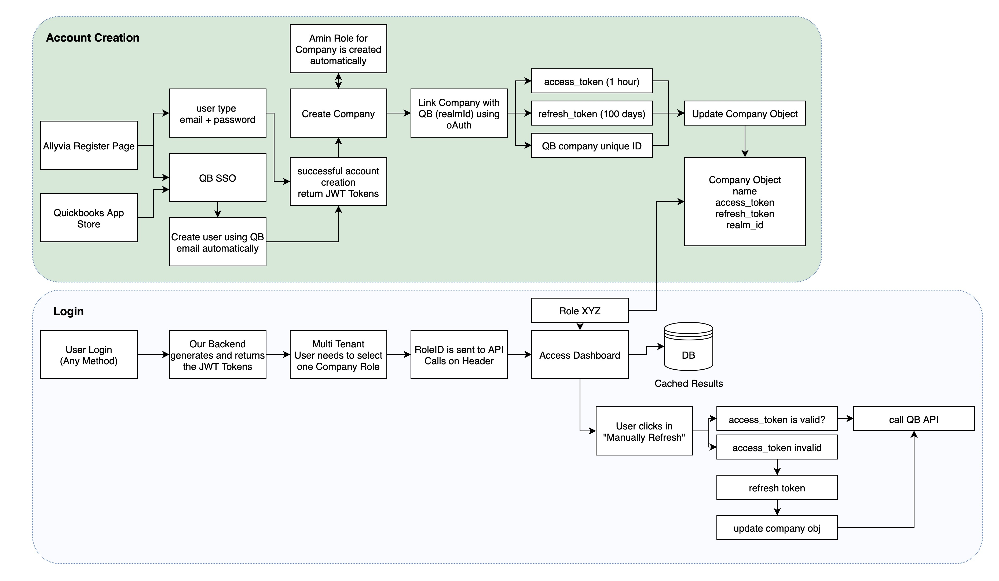

# Allyvia API

This is the backend API for the Allyvia Quickbooks Integration app. It provides authentication, user management, and integration with the Quickbooks API.

## Prerequisites

- Python 3.8+
- Django 5.0+
- Quickbooks Developer Account

## Auth Flow


## Development Setup

1. Clone the repository:
```bash
git clone git@github.com:Allyvia-Teams/backend.git
cd backend/app
```

2. Set up a virtual environment:
```bash
python3 -m venv venv
source venv/bin/activate
```

3. Install dependencies:
```bash
pip install -r requirements.txt
```

4. Configure environment variables:
Copy the `.env.example` file to a new file named `.env` and update the values:
```bash
cp .env.example .env
```

5. Run migrations:
```bash
cd app
python manage.py makemigrations
python manage.py migrate
```

6. Create a superuser:
```bash
python manage.py createsuperuser
```

7. Run the development server:
```bash
python manage.py runserver
```

## API Documentation

The API documentation is available at:

- **Swagger UI**: `http://localhost:8000/swagger/`
- **ReDoc**: `http://localhost:8000/redoc/`
- **OpenAPI JSON**: `http://localhost:8000/swagger.json`
- **OpenAPI YAML**: `http://localhost:8000/swagger.yaml`

## QuickBooks Integration Setup

### 1. Create QuickBooks App
1. Go to [QuickBooks Developer Portal](https://developer.intuit.com/)
2. Create a new app
3. Configure OAuth settings:
   - **Redirect URI**: Frontend callback URL (e.g., `http://localhost:5173/auth/callback`)
   - **Scope**: `com.intuit.quickbooks.accounting`

### 2. Configure Environment Variables
Update `.env` file with the QuickBooks app credentials:
- `QUICKBOOKS_CLIENT_ID`: App Client ID
- `QUICKBOOKS_CLIENT_SECRET`: App Client Secret
- `QUICKBOOKS_REDIRECT_URI`: Frontend callback URL

## Docker Setup

The application can also be run in Docker containers for both development and production environments.

### Development Environment

To run the application in development mode:

1. Make sure you have Docker and Docker Compose installed
2. Copy development environment variables:
   ```
   cp app/.env.example app/.env
   ```
3. Start the development containers:
   ```
   docker-compose up --build
   ```
4. The application will be available at http://localhost:8000
