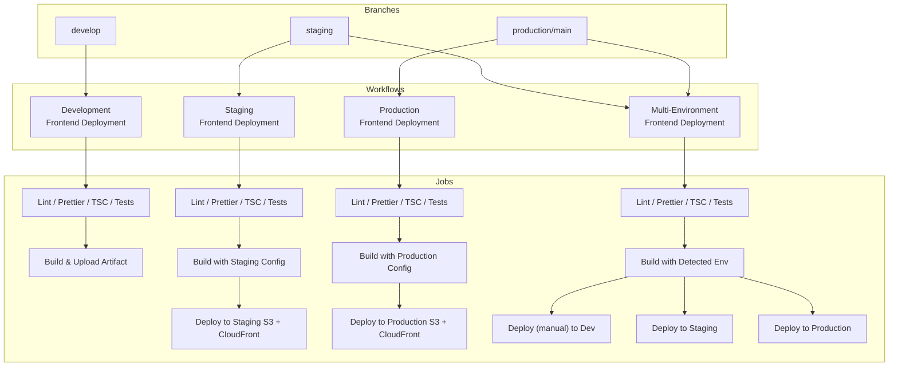

# Frontend CI/CD Workflows

This document captures each GitHub Actions workflow, its triggers, quality checks, and deployment targets.

---

## Branch to Workflow Mapping

| Branch / Trigger                                          | Workflow File                             | Purpose                                                                                  | Deploys?    |
| --------------------------------------------------------- | ----------------------------------------- | ---------------------------------------------------------------------------------------- | ----------- |
| `develop` (push)                                          | `.github/workflows/deploy-dev.yml`        | Lint, Prettier check, TypeScript check, optional tests, build artifact                   | No          |
| `staging` (push)                                          | `.github/workflows/deploy-staging.yml`    | Quality checks, build with staging config, deploy to staging S3 + CloudFront             | Yes         |
| `production` / `main` (push)                              | `.github/workflows/deploy-production.yml` | Quality checks, build with production config, deploy to production S3 + CloudFront       | Yes         |
| `staging`, `production`, `main` (push) or manual dispatch | `.github/workflows/deploy.yml`            | Multi-environment pipeline, builds once, deploys based on environment (dev/staging/prod) | Conditional |

---

## Workflow Breakdown

### Development Frontend Deployment (`deploy-dev.yml`)

- **Triggers**: `push` to `develop`, manual dispatch.
- **Jobs**:
  1. `test`: `npm run lint`, `prettier --check`, `tsc --noEmit`, optional Vitest.
  2. `build`: `npm run build`, upload `dist/` as the `build-dev` artifact.
- **Deployment**: _Not automated_ – artifacts are available for manual verification.

### Staging Frontend Deployment (`deploy-staging.yml`)

- **Triggers**: `push` to `staging`, manual dispatch.
- **Jobs**:
  1. `test`: lint, prettier, typecheck, optional tests.
  2. `build`: injects staging `.env.production`, runs `npm run build`.
  3. `deploy`: syncs `dist/` to `allyvia-staging-frontend` S3, sets cache headers, invalidates the staging CloudFront distribution, posts summary.

### Production Frontend Deployment (`deploy-production.yml`)

- **Triggers**: `push` to `production` or `main`, manual dispatch.
- **Jobs** mirror staging but target production S3 bucket and CloudFront distribution.

### Multi-Environment Frontend Deployment (`deploy.yml`)

- **Triggers**: `push` to `staging`, `production`, `main`, or manual environment selection.
- **Jobs**:
  1. `test`: lint / typecheck / optional tests (same as others).
  2. `build`: detects environment, creates `.env.production`, runs build, uploads artifact.
  3. Deploy jobs conditionally run based on environment:
     - `development` deploy only if manual input specifies `dev`.
     - `staging` deploy for `staging` branch or manual selection.
     - `production` deploy for `production`/`main` or manual selection.

---

## Flow Diagram (Mermaid)

---

## TL;DR

- `develop` branch runs QA checks and builds artifacts for manual verification; no automatic deploy.
- `staging` branch deploys fully to staging infrastructure.
- `production`/`main` branches deploy to the live environment.
- The multi-environment workflow (`deploy.yml`) supports all environments and can be triggered manually when needed.
