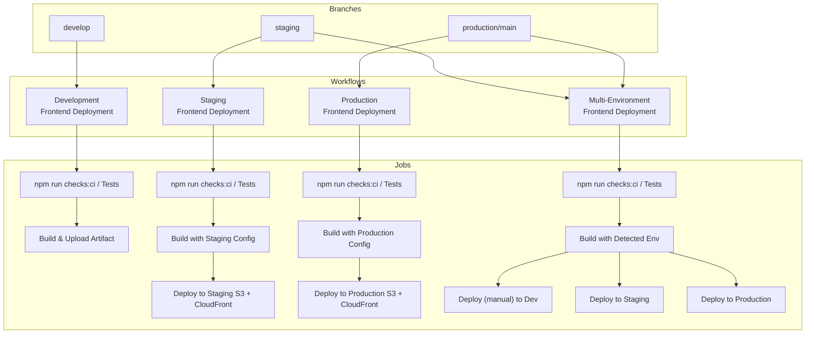

# Frontend CI/CD Workflows

This document captures each GitHub Actions workflow, its triggers, quality checks, and deployment targets.

---

## Branch to Workflow Mapping

| Branch / Trigger                                          | Workflow File                             | Purpose                                                                                                       | Deploys?    |
| --------------------------------------------------------- | ----------------------------------------- | ------------------------------------------------------------------------------------------------------------- | ----------- |
| `develop` (push)                                          | `.github/workflows/deploy-dev.yml`        | Code quality checks (`npm run checks:ci`), optional tests, build artifact                                     | No          |
| `staging` (push)                                          | `.github/workflows/deploy-staging.yml`    | Code quality checks (`npm run checks:ci`), build with staging config, deploy to staging S3 + CloudFront       | Yes         |
| `production` / `main` (push)                              | `.github/workflows/deploy-production.yml` | Code quality checks (`npm run checks:ci`), build with production config, deploy to production S3 + CloudFront | Yes         |
| `staging`, `production`, `main` (push) or manual dispatch | `.github/workflows/deploy.yml`            | Multi-environment pipeline, builds once, deploys based on environment (dev/staging/prod)                      | Conditional |

---

## Workflow Breakdown

### Development Frontend Deployment (`deploy-dev.yml`)

- **Triggers**: `push` to `develop`, manual dispatch.
- **Jobs**:
  1. `test`: `npm run checks:ci` (runs lint and typecheck, no build), optional Vitest tests.
  2. `build`: Runs `npm run build` and uploads `dist/` as the `build-dev` artifact.
- **Deployment**: _Not automated_ – artifacts are available for manual verification.

### Staging Frontend Deployment (`deploy-staging.yml`)

- **Triggers**: `push` to `staging`, manual dispatch.
- **Jobs**:
  1. `test`: `npm run checks:ci` (runs lint and typecheck, no build), optional tests.
  2. `build`: Runs `npm run build` with staging configuration.
  3. `deploy`: syncs `dist/` to `allyvia-staging-frontend` S3, sets cache headers, invalidates the staging CloudFront distribution, posts summary.

### Production Frontend Deployment (`deploy-production.yml`)

- **Triggers**: `push` to `production` or `main`, manual dispatch.
- **Jobs** mirror staging but target production S3 bucket and CloudFront distribution.

### Multi-Environment Frontend Deployment (`deploy.yml`)

- **Triggers**: `push` to `staging`, `production`, `main`, or manual environment selection.
- **Jobs**:
  1. `test`: `npm run checks:ci` (runs lint and typecheck, no build), optional tests.
  2. `build`: Detects environment, creates `.env.production`, runs `npm run build`, uploads artifact.
  3. Deploy jobs conditionally run based on environment:
     - `development` deploy only if manual input specifies `dev`.
     - `staging` deploy for `staging` branch or manual selection.
     - `production` deploy for `production`/`main` or manual selection.

---

## Flow Diagram (Mermaid)

---

## TL;DR

- **Pre-commit**: Fast formatting and lint fixes only (< 10 seconds)
- **Pre-push**: Full validation including build (catches issues before CI)
- **CI Test Job**: Uses `npm run checks:ci` (lint + typecheck, no build) - optimized performance
- **CI Build Job**: Single build with environment-specific config - no redundancy
- `develop` branch runs code quality checks and builds artifacts for manual verification; no automatic deploy.
- `staging` branch deploys fully to staging infrastructure.
- `production`/`main` branches deploy to the live environment.
- The multi-environment workflow (`deploy.yml`) supports all environments and can be triggered manually when needed.

## Code Quality Checks

### Available Check Scripts

- **`npm run checks`**: Full validation (lint + typecheck + build) - Use for local full validation or pre-push
- **`npm run checks:ci`**: CI checks without build (lint + typecheck) - Used in GitHub workflows
- **`npm run checks:fast`**: Quick checks with auto-fix (lint:fix + typecheck) - Use for quick local validation

### Git Hooks

- **Pre-commit** (`.husky/pre-commit`): Fast checks only
  - Formats code with Prettier
  - Lints and auto-fixes staged files with ESLint
  - **No build** - keeps commits fast (< 10 seconds)
- **Pre-push** (`.husky/pre-push`): Full validation
  - Runs `npm run checks` (lint + typecheck + build)
  - Catches issues before CI runs
  - Can be skipped with `git push --no-verify` if needed

### CI/CD Workflow Checks

- **Test Job**: Runs `npm run checks:ci` (lint + typecheck, no build)
- **Build Job**: Runs `npm run build` separately with environment-specific config
- This eliminates redundant builds and optimizes CI performance

### Performance Optimization

The workflow has been optimized to:

- **Pre-commit**: Fast (< 10 seconds) - formatting and lint fixes only
- **Pre-push**: Full validation including build - catches issues early
- **CI Test Job**: Quality checks without build - faster execution
- **CI Build Job**: Single build with proper environment config - no redundancy
